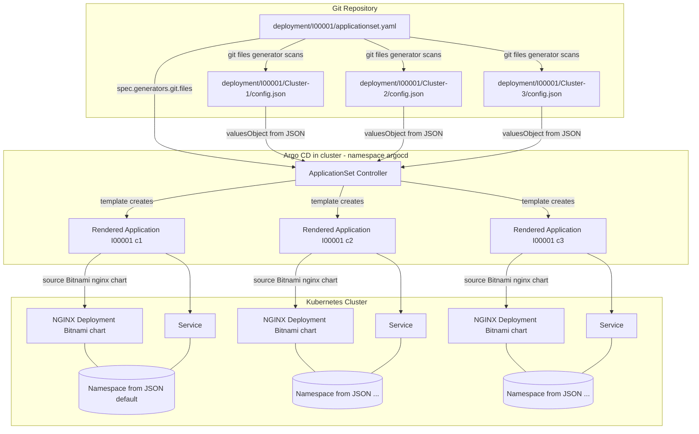

## Argo CD ApplicationSet example (per-customer)

This repo shows one ApplicationSet per customer that scans JSON files and deploys the Bitnami NGINX chart with a minimal set of values.

Prerequisite
- A brand-new Minikube cluster (empty):
```bash
minikube start
```

### Install Argo CD and ApplicationSet via Helm
```bash
helm repo add argo https://argoproj.github.io/argo-helm
helm repo update

kubectl create ns argocd || true

# Argo CD
helm upgrade --install argocd argo/argo-cd \
  --namespace argocd \
  --set controller.replicas=1 \
  --set server.service.type=ClusterIP

# ApplicationSet controller
helm upgrade --install argocd-applicationset argo/argocd-applicationset \
  --namespace argocd
```

### Apply the ApplicationSet(s)
- Apply customer I00001 only:
```bash
kubectl apply -n argocd -f "ArgoCD_Appset_example/deployment/I00001/applicationset.yaml"
```
- Or apply everything under `deployment/` (I00001 and I00017):
```bash
kubectl apply -n argocd -f "ArgoCD_Appset_example/deployment/"
```

What it does
- Each `applicationset.yaml` uses the git-files generator against this GitHub repo
  (`https://github.com/RedwanAlkurdi/argocd-applicationset-example.git`) and
  scans `deployment/Ixxxxx/**/config.json` per customer.
- Each discovered JSON turns into an Argo CD Application that deploys Bitnami NGINX with values from the JSON.

### Repository layout
- `deployment/I0000x/Cluster-y/config.json`: per-cluster JSON
- `deployment/I0000x/applicationset.yaml`: ApplicationSet for that customer

### JSON example
```json
{
  "name": "demo-I00001-c1",
  "namespace": "default",
  "image_repository": "nginx",
  "image_tag": "1.27",
  "replicaCount": 1,
  "service_type": "ClusterIP",
  "service_port": 80
}
```

### Notes
- The chart used is Bitnami NGINX from `https://charts.bitnami.com/bitnami`.
- You can modify JSON files to change only the listed values; more can be added if needed.

### Architecture (Mermaid)

